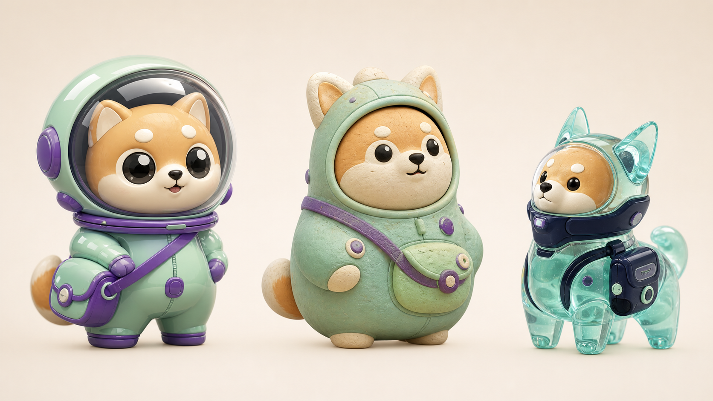

# Qpet Marketplace

Qpet turns keywords, an attached selfie, or another authorized reference into three distinct 3D chibi character directions, then prepares the selected direction for the Codex animated-pet workflow.

Current release: **v1.0.0**. The plugin manifest, skill package, marketplace catalog, unit tests, and release archives have passed the local publication gate.



## Install

```bash
codex plugin marketplace add liangxin92/qpet --ref v1.0.0
codex plugin add qpet@qpet
```

Start a new Codex task after installation so the bundled skill is loaded.

Example:

> Use $qpet:create-chibi-pet to turn “mint astronaut shiba, curious, tiny attached satchel, soft clay” into three clearly different 3D chibi directions.

For a selfie workflow, attach a photo through the visible camera/photo control and ask Qpet to preserve only the appearance cues you explicitly select.

## What Qpet includes

- three concept directions before identity lock;
- keyword, selfie, and authorized-reference inputs;
- deterministic character specifications;
- Codex v2 pet-package validation and targeted repair;
- explicit privacy boundaries for camera use and source photos;
- no credential scraping, silent camera access, telemetry, or background usage monitor.

Qpet creates a 3D-rendered animated sprite pet, not a real-time GLB model. The public Codex Pet surface does not currently expose a plugin HUD slot, so live account usage as HP is not included.

## Verify a checkout

```bash
python3 scripts/verify_marketplace.py
python3 -m unittest discover -s plugins/qpet/tests -v
python3 scripts/package_release.py --output dist
```

## Repository layout

```text
.agents/plugins/marketplace.json   Codex marketplace catalog
plugins/qpet/                      Installable Qpet plugin
scripts/                           Snapshot, verification, and packaging tools
.github/workflows/validate.yml     CI and release-artifact checks
```

## 中文

Qpet 可以根据关键词、用户主动附加的自拍或其他已授权参考图，生成三套差异明显的 3D Q 版方案，并把选定方案交给 Codex 宠物动画流程。

用户先运行 `codex plugin marketplace add liangxin92/qpet --ref v1.0.0` 添加 Marketplace，再运行 `codex plugin add qpet@qpet` 安装。自拍只能由用户通过可见的相机/照片入口主动附加；Qpet 不会静默打开相机、扫描相册或把原始自拍打包进宠物文件。

See [SUPPORT.md](SUPPORT.md), [SECURITY.md](SECURITY.md), and the [MIT license](LICENSE).
